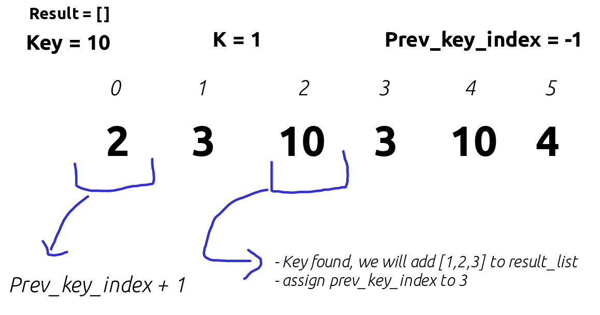
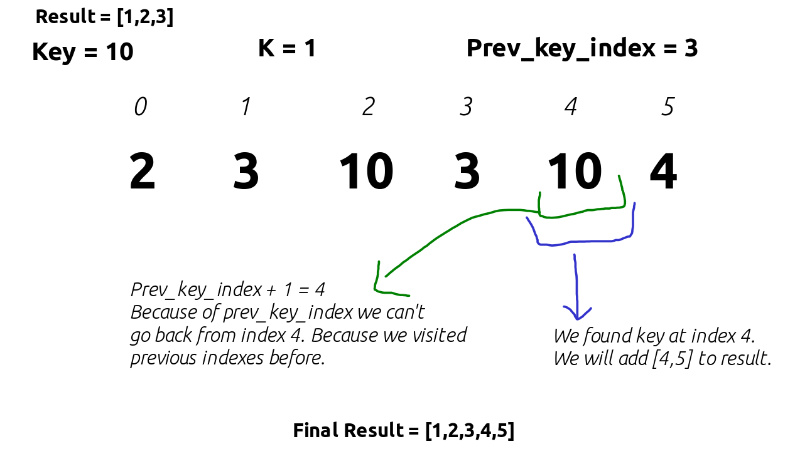

# Question

You are given a 0-indexed integer array nums and two integers key and k. A k-distant index is an index i of nums for which there exists at least one index j such that |i - j| <= k and nums[j] == key.

Return a list of all k-distant indices sorted in increasing order.

 

Example 1:

Input: nums = [3,4,9,1,3,9,5], key = 9, k = 1
Output: [1,2,3,4,5,6]
Explanation: Here, nums[2] == key and nums[5] == key.
    - For index 0, |0 - 2| > k and |0 - 5| > k, so there is no j where |0 - j| <= k and nums[j] == key. Thus, 0 is not a k-distant index.
    - For index 1, |1 - 2| <= k and nums[2] == key, so 1 is a k-distant index.
    - For index 2, |2 - 2| <= k and nums[2] == key, so 2 is a k-distant index.
    - For index 3, |3 - 2| <= k and nums[2] == key, so 3 is a k-distant index.
    - For index 4, |4 - 5| <= k and nums[5] == key, so 4 is a k-distant index.
    - For index 5, |5 - 5| <= k and nums[5] == key, so 5 is a k-distant index.
    - For index 6, |6 - 5| <= k and nums[5] == key, so 6 is a k-distant index.
    Thus, we return [1,2,3,4,5,6] which is sorted in increasing order. 

Example 2:

Input: nums = [2,2,2,2,2], key = 2, k = 2
Output: [0,1,2,3,4]
Explanation: For all indices i in nums, there exists some index j such that |i - j| <= k and nums[j] == key, so every index is a k-distant index. 
Hence, we return [0,1,2,3,4].

 

Constraints:

    1 <= nums.length <= 1000
    1 <= nums[i] <= 1000
    key is an integer from the array nums.
    1 <= k <= nums.length

# Solution

## First Try : 115 ms

```java
class Solution {
    public List<Integer> findKDistantIndices(int[] nums, int key, int k) {
        Set<Integer> indexSet = new HashSet<Integer>();
        
        for(int i=0; i<nums.length; i++){
            if(nums[i] == key){
                for(int j=i; j>i-k-1; j--){
                    if(j < 0) break;
                    indexSet.add(j);
                }
                for(int j=i+1; j<i+k+1; j++){
                    if(j >= nums.length) break;
                    indexSet.add(j);
                }
            }
        }

        List<Integer> res = new ArrayList<>(indexSet);
        Collections.sort(res);
        return res;
    }
}
```

## Second Try : 2 ms

```java
class Solution {
    public List<Integer> findKDistantIndices(int[] nums, int key, int k) {
        List<Integer> res = new ArrayList<>();

        int prev_key_index = -1;
        
        for(int i=0; i<nums.length; i++){
            if(nums[i] == key){
                // check out of index error
                int start = Math.max(0, i-k);

                // check previous key_index
                start = Math.max(start, prev_key_index + 1);

                // check out of index error
                int end = Math.min(nums.length, i+k+1);
                for(int j=start; j<end; j++){
                    res.add(j);
                }

                prev_key_index = end-1;
            }
        }

        return res;
    }
}
```

In first try i used Set to remove duplicate indices but this operations takes additional time.

In second try i used prev_key_index to reduce time complexity. prev_key_index store the last visited index of key so we cannot visit same indexes again.



-------------------------

