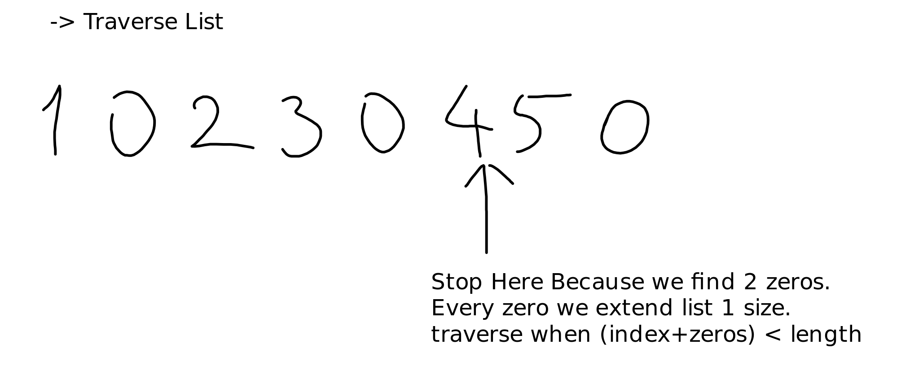
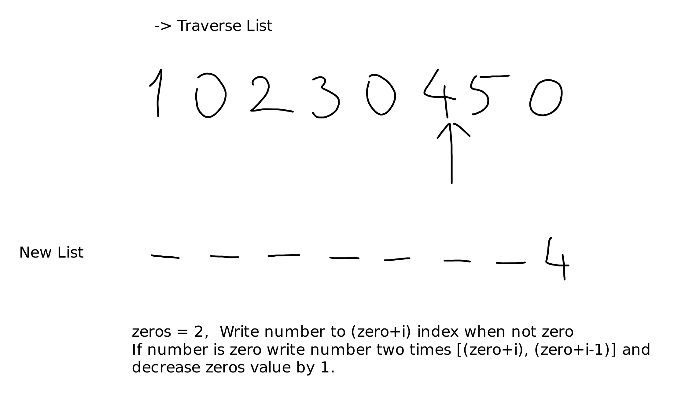
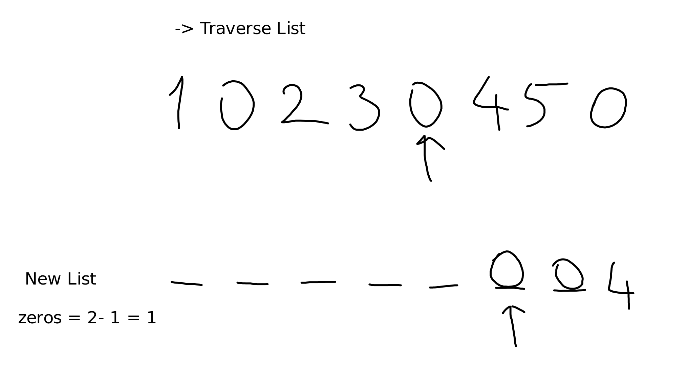
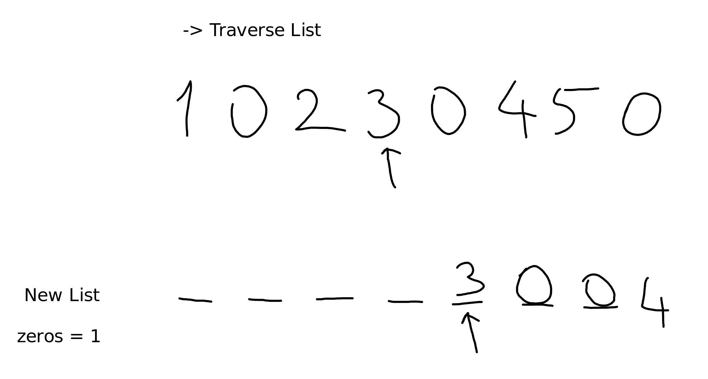
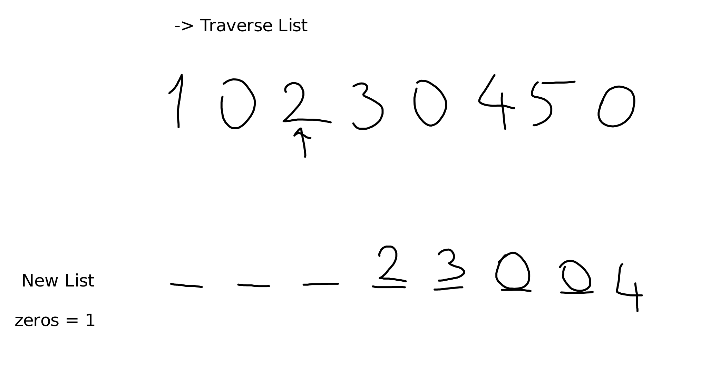
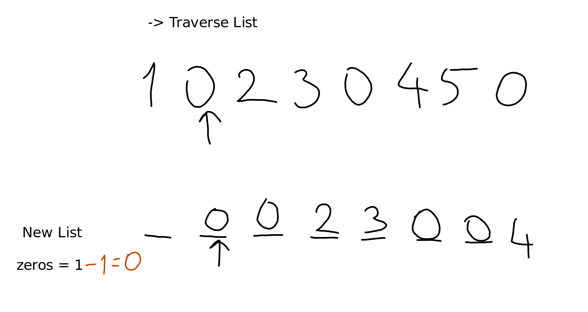
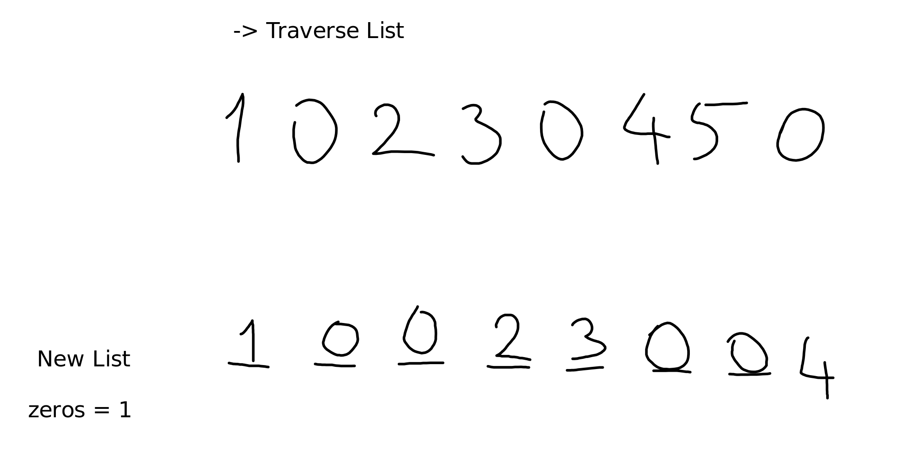

# Question

[Link](https://leetcode.com/problems/duplicate-zeros/description/)

Given a fixed-length integer array arr, duplicate each occurrence of zero, shifting the remaining elements to the right.

Note that elements beyond the length of the original array are not written. Do the above modifications to the input array in place and do not return anything.

 

    Example 1:

    Input: arr = [1,0,2,3,0,4,5,0]
    Output: [1,0,0,2,3,0,0,4]
    Explanation: After calling your function, the input array is modified to: [1,0,0,2,3,0,0,4]


"

    Example 2:

    Input: arr = [1,2,3]
    Output: [1,2,3]
    Explanation: After calling your function, the input array is modified to: [1,2,3]

 

Constraints:

    1 <= arr.length <= 104
    0 <= arr[i] <= 9

# Solution

0 ms

```java
class Solution {
    public void duplicateZeros(int[] arr) {
        int i=0;
        int zero = 0;
        while(i+zero < arr.length){
            if(arr[i] == 0){
                zero += 1;
            }
            i += 1;
        }
        int index = i-1;

        while(index > -1){
            if(arr[index] == 0){
                if(index + zero < arr.length) 
                    arr[index+zero] = 0;
                if(index+zero-1 > 0){
                    arr[index + zero - 1] = 0;
                }
                zero -= 1;
            }
            else arr[index+zero] = arr[index];
            index -= 1;
        } 
    }
}
```



***************



***************



***************



***************



***************



***************

