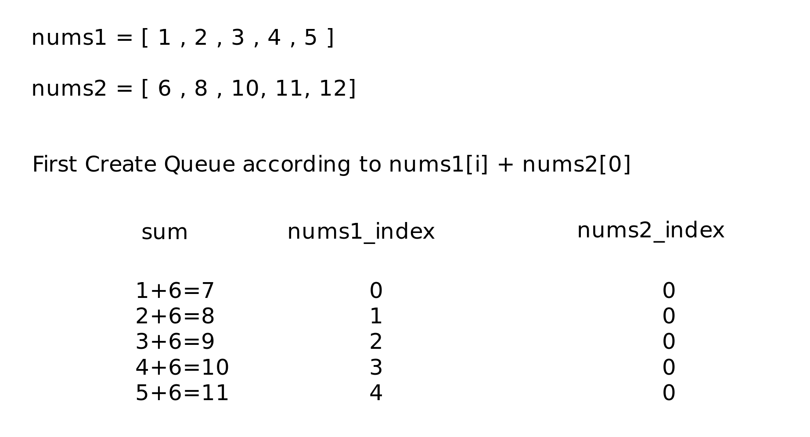
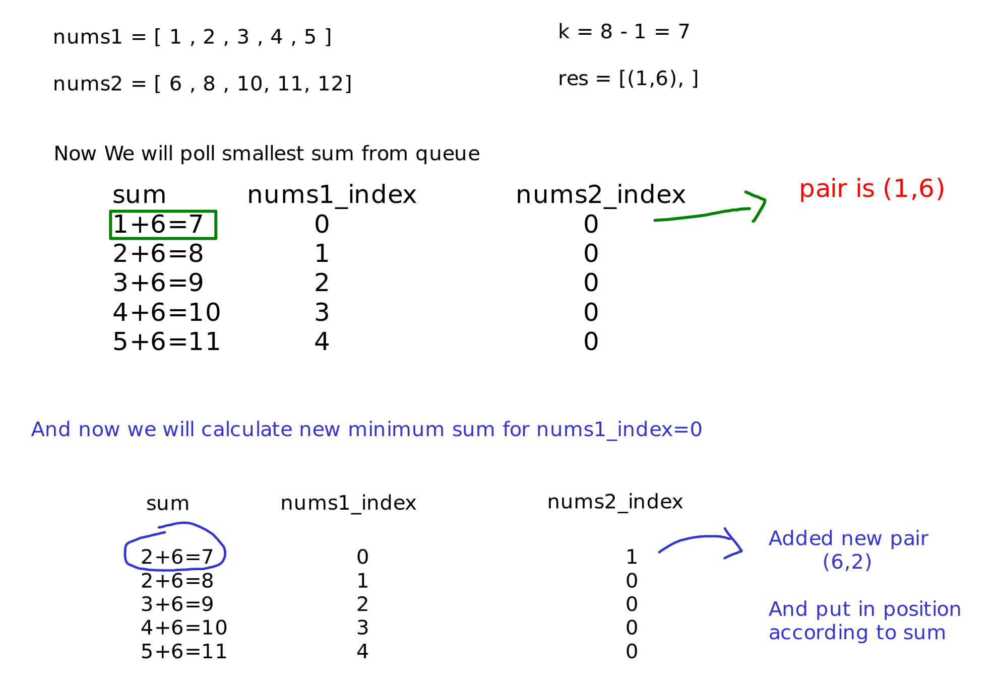
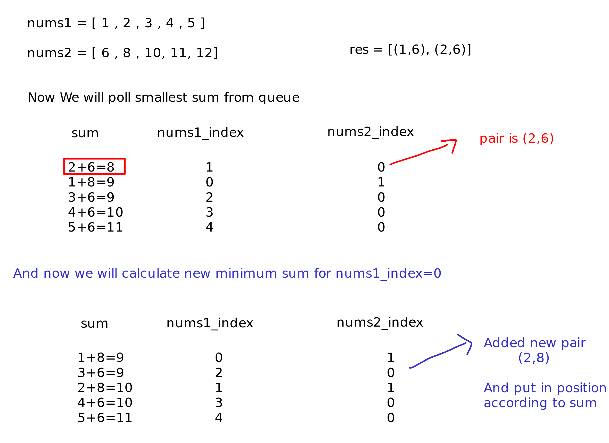
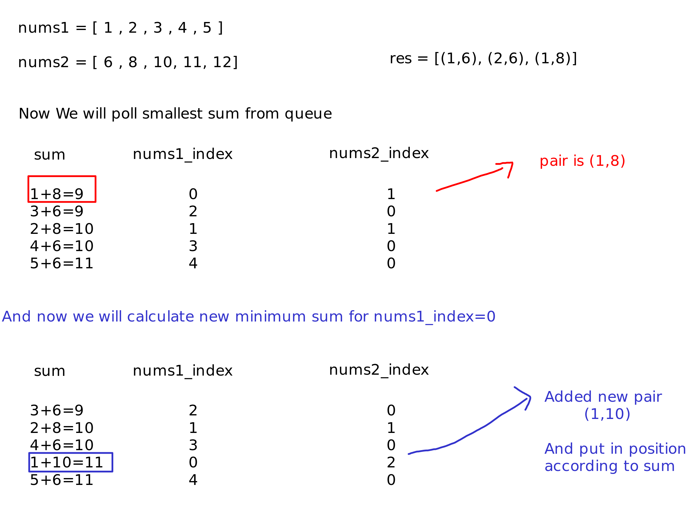

# Question

You are given two integer arrays nums1 and nums2 sorted in ascending order and an integer k.

Define a pair (u, v) which consists of one element from the first array and one element from the second array.

Return the k pairs (u1, v1), (u2, v2), ..., (uk, vk) with the smallest sums.

 

Example 1:

    Input: nums1 = [1,7,11], nums2 = [2,4,6], k = 3
    Output: [[1,2],[1,4],[1,6]]
    Explanation: The first 3 pairs are returned from the sequence: [1,2],[1,4],[1,6],[7,2],[7,4],[11,2],[7,6],[11,4],[11,6]

Example 2:

    Input: nums1 = [1,1,2], nums2 = [1,2,3], k = 2
    Output: [[1,1],[1,1]]
    Explanation: The first 2 pairs are returned from the sequence: [1,1],[1,1],[1,2],[2,1],[1,2],[2,2],[1,3],[1,3],[2,3]

Example 3:

    Input: nums1 = [1,2], nums2 = [3], k = 3
    Output: [[1,3],[2,3]]
    Explanation: All possible pairs are returned from the sequence: [1,3],[2,3]

 

Constraints:

    1 <= nums1.length, nums2.length <= 10^5
    -10^9 <= nums1[i], nums2[i] <= 10^9
    nums1 and nums2 both are sorted in ascending order.
    1 <= k <= 10^4

# Solution

45 ms

```java
class Solution {
    class Element {
        public int current_sum = 0;
        public int original_index = 0;
        public int other_list_index = 0;
    }

    class ElementComparator implements Comparator<Element> {
        @Override
        public int compare(Element e1, Element e2) {
            if (e1.current_sum >= e2.current_sum)
                return 1;
            return -1;
        }
    }

    public List<List<Integer>> kSmallestPairs(int[] nums1, int[] nums2, int k) {
        PriorityQueue<Element> pq = new PriorityQueue<>(new ElementComparator());

        for (int i = 0; i < nums1.length; i++) {
            Element element = new Element();
            element.current_sum = nums1[i] + nums2[0];
            element.original_index = i;
            element.other_list_index = 0;
            pq.add(element);
        }

        List<List<Integer>> res = new ArrayList<>();
        
        
        for (int i = 0; i < k; i++) {
            if(pq.size() == 0) break;

            Element poll = pq.poll();
            
            List<Integer> newRes = new ArrayList<>();
            newRes.add(nums1[poll.original_index]);
            newRes.add(nums2[poll.other_list_index]);
            res.add(newRes);
            if(poll.other_list_index + 1 < nums2.length){
                poll.other_list_index += 1;
                poll.current_sum = nums1[poll.original_index] + nums2[poll.other_list_index];
                pq.add(poll);
            }
        }
        return res;
    }
    
}
```
When you first read the question, you may think to use inner loop to find all the pairs and then sort them. But this will be O(n^2*logn) which is not good enough. And if you check the constraints list size is 10^5 which means you can't use O(n^2) solution. So you need to find a way to do it less than O(n^2).

My approach is first create a Class named Element and store the current sum, original index and other list index. Then create a comparator to compare the current sum. We will create a priority queue with this comparator. First, we will add pairs with the first element of the second list because the minimum summation for the first element of the first list is the first element of the second list.

If we used ArrayList to store Element's every time we add new Element array will shift values and that means every adding operation is O(n) time. If we used LinkedList every time we add new Element we need to find the correct position to add and that means every adding operation is O(n) time . But we used PriorityQueue because every time we add new Element it will be O(logn) time.

After that each time we poll the element from the priority queue and add it to the result list. Then we will check if the other list index is less than the length of the other list. If it is less than the length of the other list we will increase the other list index and update the current sum and add it to the priority queue. We will do this k times. So the time complexity will be O(klogn).

# Example



---------------------



---------------------



---------------------

