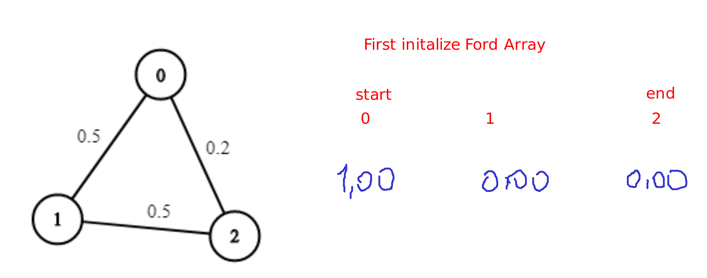
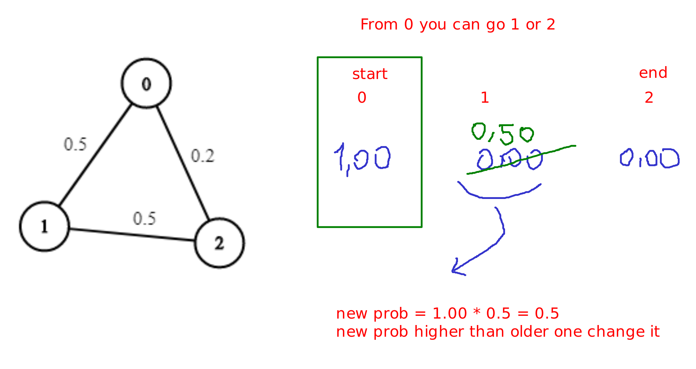
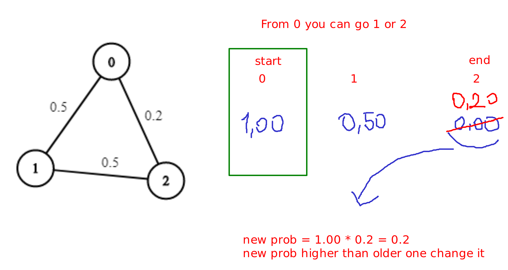
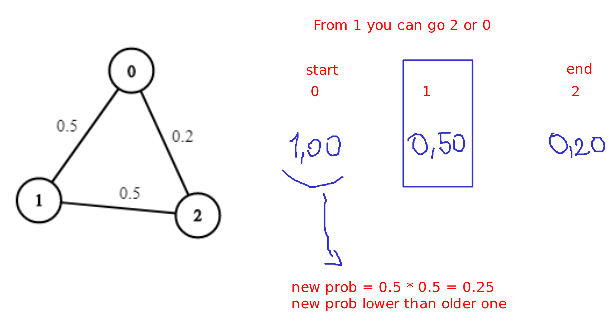
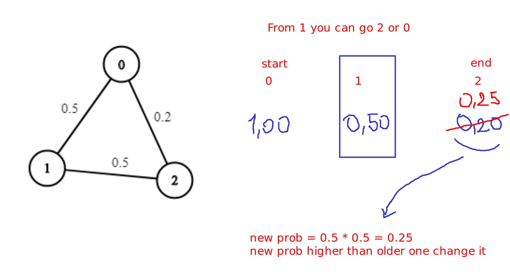
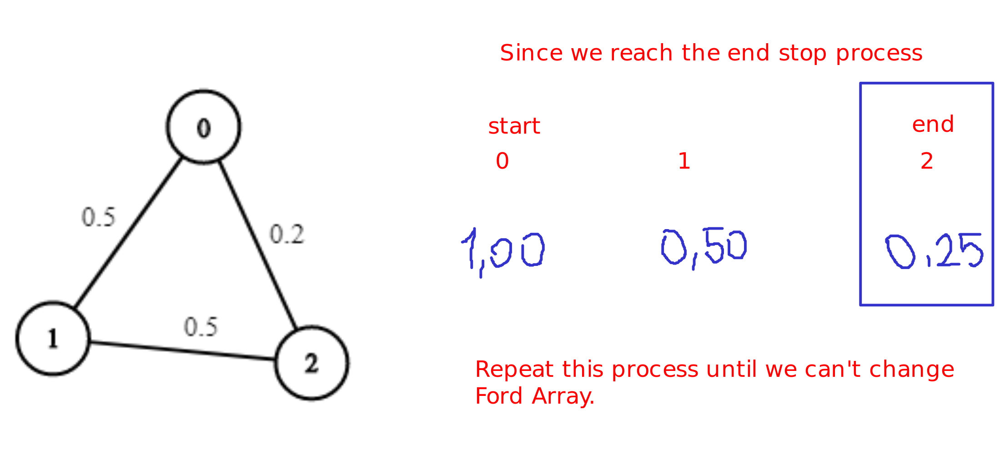

# Question

[Question Link](https://leetcode.com/problems/path-with-maximum-probability/)

You are given an undirected weighted graph of n nodes (0-indexed), represented by an edge list where edges[i] = [a, b] is an undirected edge connecting the nodes a and b with a probability of success of traversing that edge succProb[i].

Given two nodes start and end, find the path with the maximum probability of success to go from start to end and return its success probability.

If there is no path from start to end, return 0. Your answer will be accepted if it differs from the correct answer by at most 1e-5.

 

    


    Example 1:
    Input: n = 3, edges = [[0,1],[1,2],[0,2]], succProb = [0.5,0.5,0.2], start = 0, end = 2
    Output: 0.25000
    Explanation: There are two paths from start to end, one having a probability of success = 0.2 and the other has 0.5 * 0.5 = 0.25.

    


    Example 2:
    Input: n = 3, edges = [[0,1],[1,2],[0,2]], succProb = [0.5,0.5,0.3], start = 0, end = 2
    Output: 0.30000


    Example 3:

    Input: n = 3, edges = [[0,1]], succProb = [0.5], start = 0, end = 2
    Output: 0.00000
    Explanation: There is no path between 0 and 2.

 

Constraints:

    2 <= n <= 10^4
    0 <= start, end < n
    start != end
    0 <= a, b < n
    a != b
    0 <= succProb.length == edges.length <= 2*10^4
    0 <= succProb[i] <= 1
    There is at most one edge between every two nodes.


# Solution-1

Time Limit Exceed

```java
class Solution {
    class Element{
        public List<Integer> prevIndexes;
        public double prob;
        public int index;

        public Element(int index, double prob, List<Integer> prevIndexes){
            this.prevIndexes = prevIndexes; this.index = index; this.prob = prob;
        }

        public boolean inPrevIndexes(int index){
            for(int i=0; i<prevIndexes.size(); i++){
                if(index == prevIndexes.get(i)) return true;
            }
            return false;
        }
    }

    class ElementComparator implements Comparator<Element>{
        @Override
        public int compare(Element e1, Element e2){
            if(e1.prob < e2.prob) return 1;
            return -1;
        }
    }

    public double maxProbability(int n, int[][] edges, double[] succProb, int start, int end) {
        ElementComparator eComp = new ElementComparator();
        PriorityQueue<Element> pq = new PriorityQueue<>(eComp);

        HashMap<Integer, List<Double>> dict = new HashMap<Integer, List<Double>>();

        for(int i=0; i<edges.length; i++){
            int i_0 = edges[i][0];
            int i_1 = edges[i][1];
            if(! dict.containsKey(i_0)) dict.put(i_0, new ArrayList<Double>());
            if(! dict.containsKey(i_1)) dict.put(i_1, new ArrayList<Double>());
            dict.get(i_0).add(i_1 * 1.0);
            dict.get(i_0).add(succProb[i]);
            dict.get(i_1).add(i_0 * 1.0);
            dict.get(i_1).add(succProb[i]);
            
        }
        
        /*
        for(int i : dict.keySet()){
            System.out.println(i);
            for(int j=0; j<dict.get(i).size(); j++) System.out.print(dict.get(i).get(j) + " ");
            System.out.println();
        }*/

        if(dict.containsKey(start))
            for(int i=0; i<dict.get(start).size(); i+=2){
                //int index = (int) dict.get(start).get(i);
                int index = Double.valueOf(dict.get(start).get(i)).intValue();
                double prob = dict.get(start).get(i+1);
                List<Integer> arr = new ArrayList<Integer>(); arr.add(start);
                pq.add(new Element(index, 1 * prob, arr));
            }

        double maxProb = Double.MIN_VALUE;

        while(pq.size() > 0){
            Element e = pq.poll();
            if(e.prob < maxProb) continue;

            if(e.index == end){
                maxProb = e.prob;
            }
            else{
                if(dict.containsKey(e.index))
                    for(int i=0; i<dict.get(e.index).size(); i+=2){
                        int index = Double.valueOf(dict.get(e.index).get(i)).intValue();
                
                        if(e.inPrevIndexes(index)) continue;

                        double prob = dict.get(e.index).get(i+1);
                        e.prevIndexes.add(e.index);
                        pq.add(new Element(index, e.prob * prob, e.prevIndexes));
                    }

            }
        }
        
        if(maxProb != Double.MIN_VALUE) return maxProb;

        return 0.0;
    }
}
```

First I store index-connected indexes pairs on HashMap. Then I use PriorityQueue to store the Element class which contains index, prob, and prevIndexes. prevIndexes is used to check if the index is already visited. If the index is already visited, then I don't need to add the index to the PriorityQueue. I also use ElementComparator to sort the Element class by prob in descending order. If the prob is smaller than maxProb, then I don't need to add the Element to the PriorityQueue. If the index is end, then I update the maxProb. If the PriorityQueue is empty, then I return 0.0.

But this solution exceeds the time limit.

# Solution-2

Since this is a [shortest path problem](https://en.wikipedia.org/wiki/Shortest_path_problem) we will use a common-sense algorithm called Bellman-Ford.

```java
class Solution {
    class Element{
        public int prob;
        public int index;

        public Element(int index){
            this.index = index; this.prob = Integer.MAX_VALUE;
        }
    }

    public double maxProbability(int n, int[][] edges, double[] succProb, int start, int end) {
        HashMap<Integer, List<Double>> dict = new HashMap<Integer, List<Double>>();

        for(int i=0; i<edges.length; i++){
            int i_0 = edges[i][0];
            int i_1 = edges[i][1];
            if(! dict.containsKey(i_0)) dict.put(i_0, new ArrayList<Double>());
            if(! dict.containsKey(i_1)) dict.put(i_1, new ArrayList<Double>());
            dict.get(i_0).add(i_1 * 1.0);
            dict.get(i_0).add(succProb[i]);
            dict.get(i_1).add(i_0 * 1.0);
            dict.get(i_1).add(succProb[i]);
            
        }
        
        /*
        for(int i : dict.keySet()){
            System.out.println(i);
            for(int j=0; j<dict.get(i).size(); j++) System.out.print(dict.get(i).get(j) + " ");
            System.out.println();
        }*/

        // Bellman-Ford Algorithm

        HashMap<Integer, Double> ford = new HashMap<Integer, Double>();

        for(int i : dict.keySet()){
            ford.put(i, 0.00);
        }

        ford.replace(start, 1.00);

        boolean isChanged = true;

        // Traverse Edges
        while(isChanged){
            isChanged = false;

            for(int index : dict.keySet()){
                
                // get edges for index
                for(int j=0; j<dict.get(index).size(); j+=2){
                    int index_2 = Double.valueOf(dict.get(index).get(j)).intValue();
                    double prob = dict.get(index).get(j+1);

                    // If new prob is higher change with older one
                    double new_prob = ford.get(index) * prob;
                    if(ford.get(index_2) < new_prob){
                        isChanged = true;
                        ford.replace(index_2, new_prob);
                    }
                }

            }
        }

        double res = ford.containsKey(end) ? ford.get(end) : 0.00;
        return res;
    }
}
```

# Example:



-------------------------



-------------------------



-------------------------



-------------------------



-------------------------

