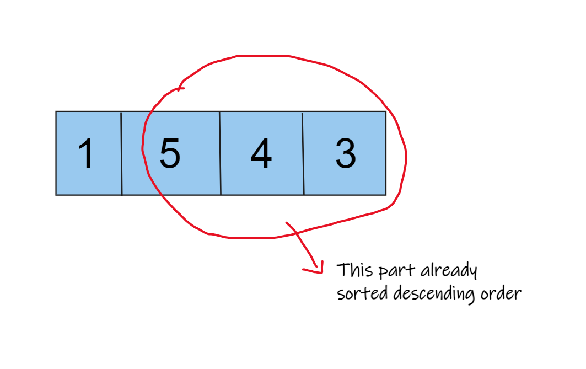
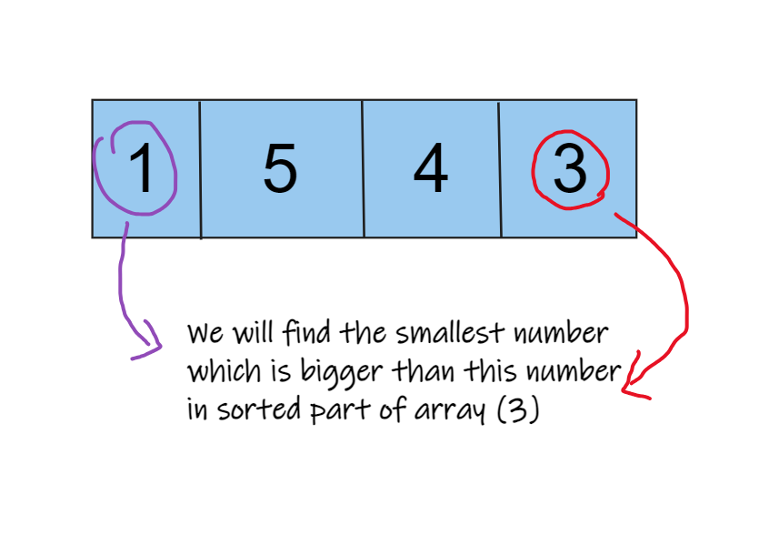
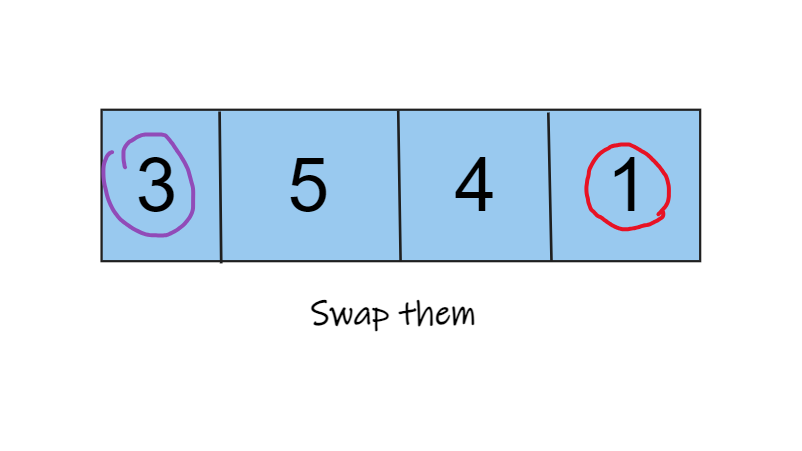
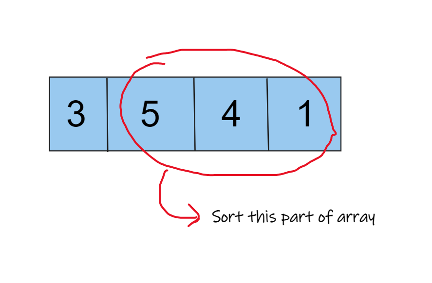
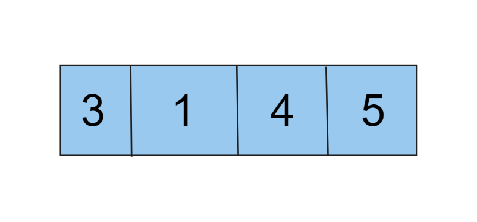

# Question

[Question Link](https://leetcode.com/problems/next-permutation/description/)

A permutation of an array of integers is an arrangement of its members into a sequence or linear order.

    For example, for arr = [1,2,3], the following are all the permutations of arr: [1,2,3], [1,3,2], [2, 1, 3], [2, 3, 1], [3,1,2], [3,2,1].

The next permutation of an array of integers is the next lexicographically greater permutation of its integer. More formally, if all the permutations of the array are sorted in one container according to their lexicographical order, then the next permutation of that array is the permutation that follows it in the sorted container. If such arrangement is not possible, the array must be rearranged as the lowest possible order (i.e., sorted in ascending order).

    For example, the next permutation of arr = [1,2,3] is [1,3,2].
    Similarly, the next permutation of arr = [2,3,1] is [3,1,2].
    While the next permutation of arr = [3,2,1] is [1,2,3] because [3,2,1] does not have a lexicographical larger rearrangement.

Given an array of integers nums, find the next permutation of nums.

The replacement must be in place and use only constant extra memory.

 

Example 1:

    Input: nums = [1,2,3]
    Output: [1,3,2]

Example 2:

    Input: nums = [3,2,1]
    Output: [1,2,3]

Example 3:

    Input: nums = [1,1,5]
    Output: [1,5,1]

 

Constraints:

    1 <= nums.length <= 100
    0 <= nums[i] <= 100


# Solution

Time Complexity: O(n)
Runtime : 1ms

First we will try to find sorted descending order from right to left. Since this part sorted in descending order next permutation of this part will be sorted ascending order.

But we must change the number before head of this part of array. We will find the smallest number which is bigger than this number and swap them. Then we will sort the part after the head of this part of array. We can use binary search to find the smallest number which is bigger than this number.











```java
class Solution {

    public int sortedIndex(int[] nums){
        int res = nums.length - 1 ;
        for(int i = nums.length - 2 ; i > -1 ; i--){
            if(nums[i] >= nums[i+1]) res = i;
            else break;
        }
        return res;
    }

    public void nextPermutation(int[] nums) {
        int index = sortedIndex(nums);
        List<Integer> liste = new ArrayList<Integer>();
        for(int i=index; i<nums.length; i++){
               liste.add(nums[i]);
        }

        if(index == 0){
            Collections.sort(liste);
            for(int i=0; i<liste.size(); i++){
                nums[i] = liste.get(i);
            }
            return;
        }

        int temp = nums[index-1];

        // b-search for finding next bigger number
        int l=index, h=nums.length-1;
        while(l <= h){
            int mid = (h+l)/2;
            if(temp >= nums[mid]){
                h = mid-1;
            }
            else{
                l = mid+1;
            }
        }
        l = Math.max(l, index+1);
        //System.out.println(l-1 + " " + nums[l-1]);

        nums[index-1] = nums[l-1];
        liste.set(l-1-index, temp);
        Collections.sort(liste);

        for(int i=index; i < nums.length ; i++){
            nums[i] = liste.get(i - index);
        }
        
    }
}
```