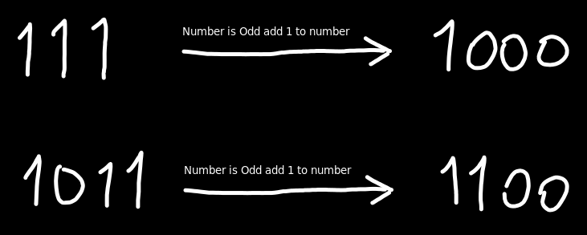

# Question

Given the binary representation of an integer as a string s, return the number of steps to reduce it to 1 under the following rules:

    If the current number is even, you have to divide it by 2.

    If the current number is odd, you have to add 1 to it.

It is guaranteed that you can always reach one for all test cases.

 

Example 1:

Input: s = "1101"
Output: 6
Explanation: "1101" corressponds to number 13 in their decimal representation.
Step 1) 13 is odd, add 1 and obtain 14. 
Step 2) 14 is even, divide by 2 and obtain 7.
Step 3) 7 is odd, add 1 and obtain 8.
Step 4) 8 is even, divide by 2 and obtain 4.  
Step 5) 4 is even, divide by 2 and obtain 2. 
Step 6) 2 is even, divide by 2 and obtain 1.  

Example 2:

Input: s = "10"
Output: 1
Explanation: "10" corressponds to number 2 in their decimal representation.
Step 1) 2 is even, divide by 2 and obtain 1.  

Example 3:

Input: s = "1"
Output: 0

 

Constraints:

    1 <= s.length <= 500
    s consists of characters '0' or '1'
    s[0] == '1'

# Solution

As you can see in constraints length of string is very big and we cannot convert this bits to integer. So we need to find a way to solve this problem without converting to integer.

20 ms

```java
class Solution {
    public int numSteps(String s) {
        int res = 0;
        List<Character> charArray = new ArrayList<>();
        
        for(int i=s.length()-1; i>-1; i--){
            charArray.add(s.charAt(i));
        }

        int i = 0;
        int last_zero_index = -1;
        while(i < charArray.size() - 1){
            Character ch = charArray.get(i);
            if(ch.equals('1')){
                res += 2;
                boolean foundZero = false;
                int j;

                for(j = Math.max(last_zero_index, i+1); j<charArray.size(); j++){
                    if(charArray.get(j).equals('0')){
                        foundZero = true;
                        charArray.set(j, '1');
                        last_zero_index = j;
                        break;
                    }
                    res += 1;
                }
                i = j;
                if (!foundZero) charArray.add('1');
            }
            else{
                res += 1;
                i += 1;
            }
            System.out.println(i + " " + res);
        }

        return res;

    }
}
```

If last bit is 0, we can just divide by 2. If last bit is 1, we need to add 1 and then divide by 2. So we can just iterate from last bit to first bit and do the operations.



As you can see from image when you add 1 to number you traverse from current index to left until you find 0. And change all 1s to 0s. 

We store last zero bit index to not traverse all bits again. If we find 0 before last zero bit index we can just change it to 1 and stop traversing.