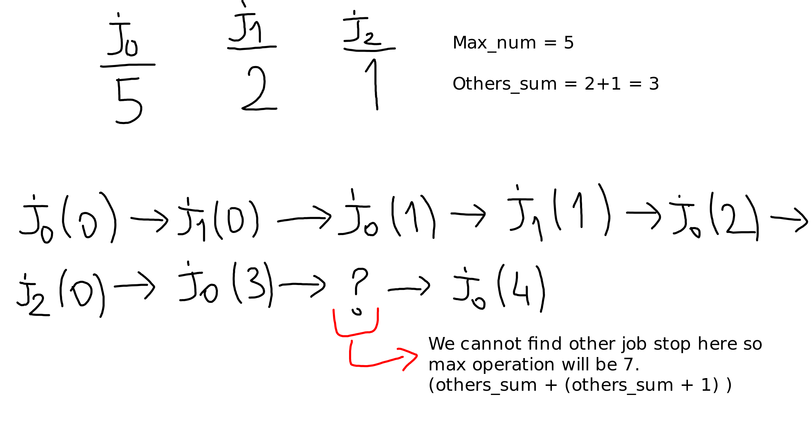
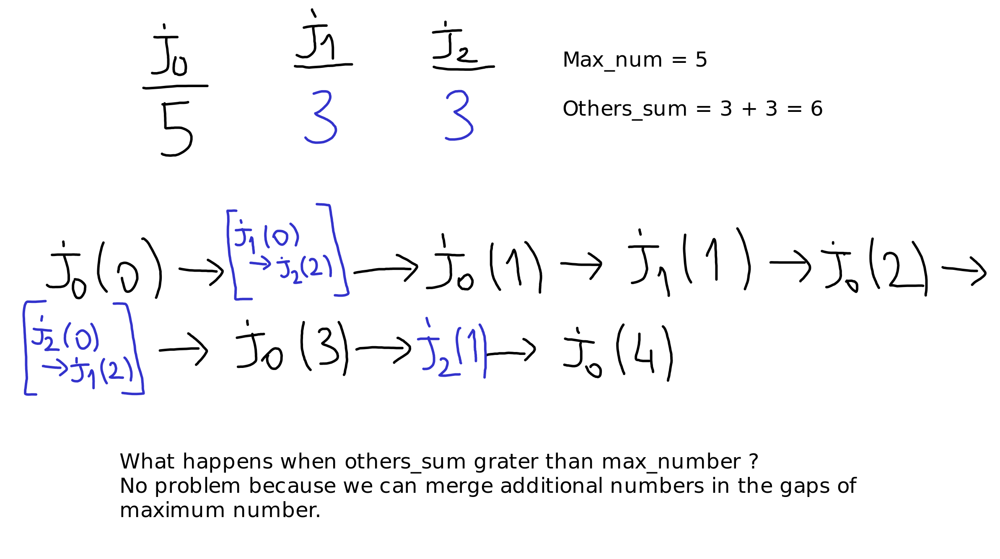

# Question

There are n projects numbered from 0 to n - 1. You are given an integer array milestones where each milestones[i] denotes the number of milestones the ith project has.

You can work on the projects following these two rules:

Every week, you will finish exactly one milestone of one project. You must work every week.
You cannot work on two milestones from the same project for two consecutive weeks.

Once all the milestones of all the projects are finished, or if the only milestones that you can work on will cause you to violate the above rules, you will stop working. Note that you may not be able to finish every project's milestones due to these constraints.

Return the maximum number of weeks you would be able to work on the projects without violating the rules mentioned above.

 

Example 1:

    Input: milestones = [1,2,3]
    Output: 6
    Explanation: One possible scenario is:
    ​​​​- During the 1st week, you will work on a milestone of project 0.
    - During the 2nd week, you will work on a milestone of project 2.
    - During the 3rd week, you will work on a milestone of project 1.
    - During the 4th week, you will work on a milestone of project 2.
    - During the 5th week, you will work on a milestone of project 1.
    - During the 6th week, you will work on a milestone of project 2.
    The total number of weeks is 6.

Example 2:

    Input: milestones = [5,2,1]
    Output: 7
    Explanation: One possible scenario is:
    - During the 1st week, you will work on a milestone of project 0.
    - During the 2nd week, you will work on a milestone of project 1.
    - During the 3rd week, you will work on a milestone of project 0.
    - During the 4th week, you will work on a milestone of project 1.
    - During the 5th week, you will work on a milestone of project 0.
    - During the 6th week, you will work on a milestone of project 2.
    - During the 7th week, you will work on a milestone of project 0.
    The total number of weeks is 7.
    Note that you cannot work on the last milestone of project 0 on 8th week because it would violate the rules.
    Thus, one milestone in project 0 will remain unfinished.

 

Constraints:

    n == milestones.length
    1 <= n <= 105
    1 <= milestones[i] <= 109

# Solution

2 ms 

```java
class Solution {
    public long numberOfWeeks(int[] milestones) {
        long max_num = 0;
        long sum = 0;
        for(int i=0; i<milestones.length; i++){
            if(milestones[i] > max_num) max_num = milestones[i];
            sum += milestones[i];
        }
        long others_sum = sum - max_num;
        if(others_sum < max_num - 1){
            return (others_sum + 1) + others_sum;
        }
        return sum;
    }
}
```

First find maximum number of milestones and sum of all milestones except the maximum one. If we fill all gaps of maximum milestones with other milestones answer will be sum of all milestones.

But if we not able to fill all gaps answer will be <b>others_sum + (others_sum + 1)</b> beacuse we can fill others_sum gaps between others_sum + 1 milestones of maximum number.

What happens when others_sum grater than max_number ?
No problem because we can merge additional numbers in the gaps of maximum number.




