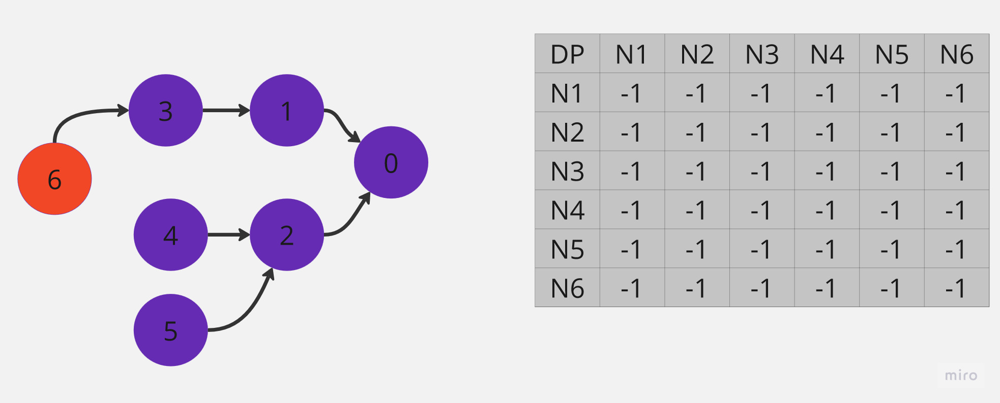
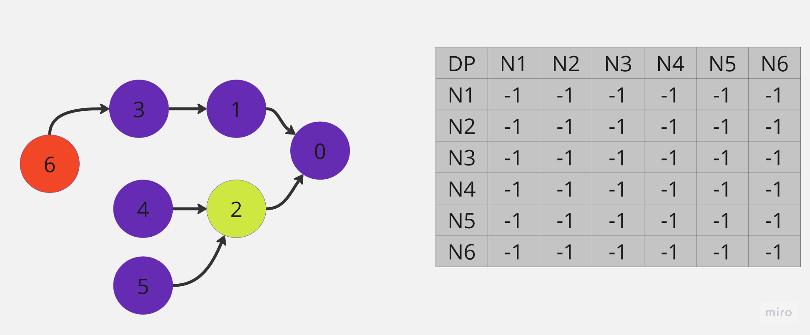
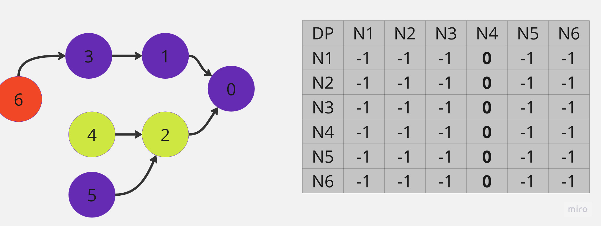
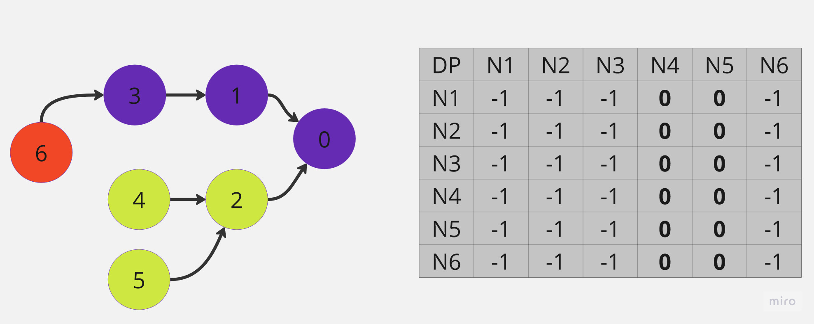
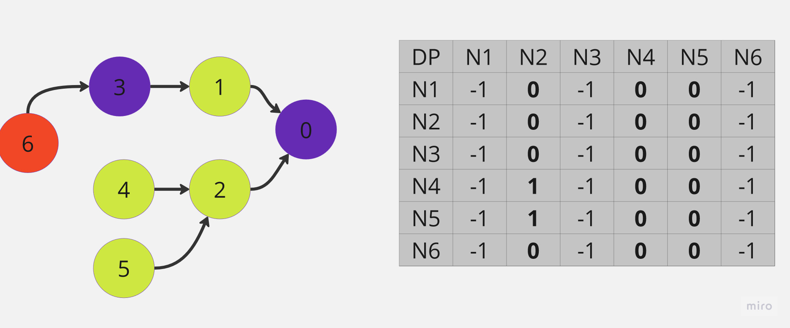
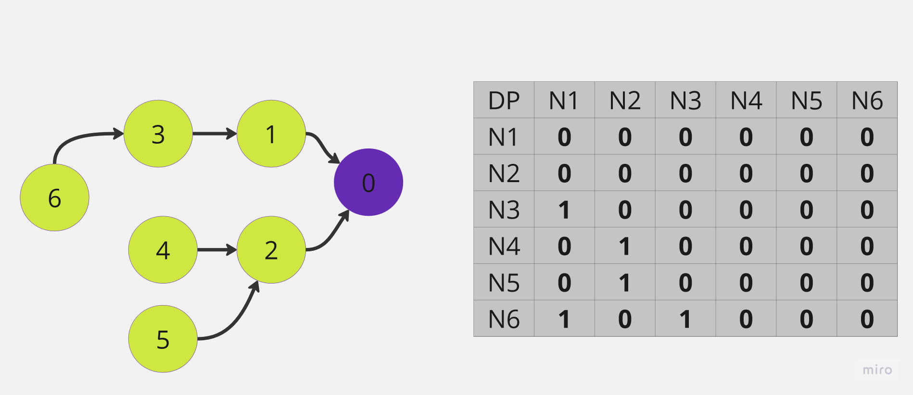

# Question

[Link](https://leetcode.com/problems/course-schedule-iv/description/)

There are a total of numCourses courses you have to take, labeled from 0 to numCourses - 1. You are given an array prerequisites where prerequisites[i] = [ai, bi] indicates that you must take course ai first if you want to take course bi.

For example, the pair [0, 1] indicates that you have to take course 0 before you can take course 1.

Prerequisites can also be indirect. If course a is a prerequisite of course b, and course b is a prerequisite of course c, then course a is a prerequisite of course c.

You are also given an array queries where queries[j] = [uj, vj]. For the jth query, you should answer whether course uj is a prerequisite of course vj or not.

Return a boolean array answer, where answer[j] is the answer to the jth query.

 

Example 1:


    Input: numCourses = 2, prerequisites = [[1,0]], queries = [[0,1],[1,0]]
    Output: [false,true]
    Explanation: The pair [1, 0] indicates that you have to take course 1 before you can take course 0.
    Course 0 is not a prerequisite of course 1, but the opposite is true.

Example 2:

    Input: numCourses = 2, prerequisites = [], queries = [[1,0],[0,1]]
    Output: [false,false]
    Explanation: There are no prerequisites, and each course is independent.

Example 3:


    Input: numCourses = 3, prerequisites = [[1,2],[1,0],[2,0]], queries = [[1,0],[1,2]]
    Output: [true,true]

 

Constraints:

    2 <= numCourses <= 100
    0 <= prerequisites.length <= (numCourses * (numCourses - 1) / 2)
    prerequisites[i].length == 2
    0 <= ai, bi <= n - 1
    ai != bi
    All the pairs [ai, bi] are unique.
    The prerequisites graph has no cycles.
    1 <= queries.length <= 104
    0 <= ui, vi <= n - 1
    ui != vi

# Solution

```java
class Solution {
    public Map<Integer, List<Integer>> map;

    public int checkPrerequisite(int[][] dp,int preq, int num){
        if(dp[num][preq] != -1) return dp[num][preq];
        
        map.computeIfAbsent(num,k -> new ArrayList<>());
        for(int before : map.get(num)){
            if(dp[before][preq] == 1 || checkPrerequisite(dp, preq, before) == 1){ 
                return dp[num][preq] = 1;
            }
        }

        return dp[num][preq] = 0; 
    }

    public List<Boolean> checkIfPrerequisite(int numCourses, int[][] prerequisites, int[][] queries) {
        map = new HashMap<>();
        int[][] dp = new int[numCourses+1][numCourses+1];
        
        for(int i=0; i<numCourses+1; i++)
            for(int j=0; j<numCourses+1; j++) dp[i][j] = -1;

        for(int[] preq : prerequisites){
            map.computeIfAbsent(preq[1],k -> new ArrayList<>()).add(preq[0]);
            dp[preq[1]][preq[0]] = 1;
        }

        ArrayList<Boolean> res = new ArrayList<>();
        for(int[] query : queries){
            if(checkPrerequisite(dp, query[0], query[1]) == 1) res.add(true);
            else res.add(false);
        }
        return res;
    }
}
```

Runtime : 24 ms (Beats 84.72%)

In this solution, firstly we will save prerequisities in a map. When we want to check if a course is a prerequisity of another course, we will check if the course is in the prerequisities of the other course. If we did not find the checked course we will iterate over this new course's prerequisities until we find the checked course (in this situation we will return true) or we did not find a course that not have any prerequisites (in this situation we will return false).

And for morther optimization, we will save the results of the checks in a Dynamic Programming (DP) array. So we will not check the same courses again and again.

For better understanding, let's look at an example:



In this example we want to check if 6 is a prerequisity of 0. In Dynamic Array table "-1" means unchecked, "0" means no prerequisity and "1" means prerequisity. Since 6 not in adjanents of 0 we will check adjanents of 6. 6 has 2 adjanents, 1 and 2. We will start with 2.



Since we did not find 0 in adjanents of 2, we will check adjanents of 2. 2 has 2 adjanents, 4 and 5. We will start with 4.



We try to check adjanents of 4 but 4 has no adjanents. This situation means 4 has no prereqisities so we can fill the DP array with 0.



And since 5 not have any prerequisities we can fill the DP array with 0.



We traversed all adjanents of 2 with DFS and we did not find 6. So we will check adjanents of 1. In DP array we wrote 1 to n2-n4 and n2-n5 because they are prerequisities of 2.



And so on we will check adjanents of 1. 1 has 1 adjanent, 3. we will check adjanents of 3. you understand the logic. Finally we completed the DP array. From now on we will not check the same courses again and again. We simply check the DP array and return the result.