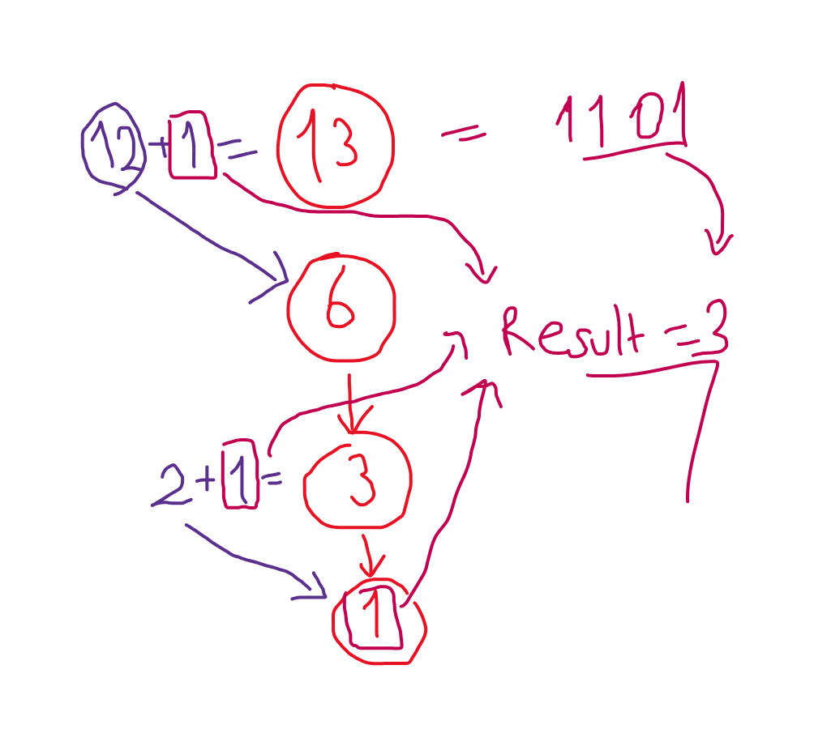

# Question

[Link](https://leetcode.com/problems/counting-bits/description/)

Given an integer n, return an array ans of length n + 1 such that for each i (0 <= i <= n), ans[i] is the number of 1's in the binary representation of i.

 

Example 1:

    Input: n = 2
    Output: [0,1,1]
    Explanation:
    0 --> 0
    1 --> 1
    2 --> 10

Example 2:

    Input: n = 5
    Output: [0,1,1,2,1,2]
    Explanation:
    0 --> 0
    1 --> 1
    2 --> 10
    3 --> 11
    4 --> 100
    5 --> 101

 

Constraints:

    0 <= n <= 105

 

Follow up:

    It is very easy to come up with a solution with a runtime of O(n log n). Can you do it in linear time O(n) and possibly in a single pass?

    Can you do it without using any built-in function (i.e., like __builtin_popcount in C++)?

# Solution 1

```java
class Solution {
    public int[] countBits(int n) {
        ArrayList<Boolean> bool_arr = new ArrayList<>();
        int[] res = new int[n+1];
        bool_arr.add(false);
        // false means 0
        // true means 1

        for(int i=0; i<=n; i++){
            int curr = 0;
            for(int j=bool_arr.size() - 1; j>=0; j--){
                if(bool_arr.get(j)) curr += 1;
            }
            res[i] = curr;

            int index = -1;
            for(int j=bool_arr.size() - 1; j>=0; j--){
                if(!bool_arr.get(j)){
                    index = j;
                    break;
                }
            }

            if(index != -1) bool_arr.set(index, true);
            else{
                bool_arr.add(0, true);
                index = 0;
            }

            for(int j=index+1; j<bool_arr.size(); j++)
                bool_arr.set(j, false);

            for(int j=0; j<bool_arr.size(); j++){
                int c = bool_arr.get(j) ? 1 : 0;
                System.out.print(c + " ");
            }
            System.out.println("");
        }

        return res;
    }
}
```

Runtime : 1821 ms (Beats 5.97%)
Memory : 48.69 mb (Beats 6.69%)

In this solution I have used an ArrayList of booleans to represent the binary representation of the number. I have used the following logic to increment the number by 1:

1. Find the rightmost 0 in the ArrayList and change it to 1.

2. Change all the bits to the right of the rightmost 0 to 0.

3. Count the number of 1s in the ArrayList.

4. Repeat the above steps until the number is n.

This solution is very slow and inefficient. I will try to improve it in the next solution.

# Solution 2

Runtime : 180 ms (Beats 5.97%)
Memory : 78.34 mb (Beats 5.59%)

```java
class Solution {
    Map<String, String> dp;

    public Solution(){
        dp = new HashMap<String, String>();
    }

    public String increment(char[] char_arr, int i, int j){
        String to_string = "";
        for(int k=i; k<j; k++) to_string += char_arr[k]; 

        if(j-i == 1){
            if(char_arr[i] == '0'){
                dp.put(to_string, "1");
            }
            else{
                dp.put(to_string, "10");
            }
            dp.get(to_string);
        }

        if(dp.containsKey(to_string)) return dp.get(to_string);
        else{
            String incremented = increment(char_arr, i+1, j);
            //System.out.println(to_string +"  // to string" + "// " + to_string.length());
            //System.out.println(incremented +"  // incremented" + "// " + incremented.length());
            if(incremented.length() == to_string.length()){
                //System.out.println("girdi");
                if(to_string.charAt(0) == '1')
                    dp.put(to_string, "10" + incremented.substring(1));
                else
                    dp.put(to_string, incremented);
            }
            else dp.put(to_string, to_string.charAt(0) + incremented);
            return dp.get(to_string);
        }

    }

    public int updateCharArray(char[] char_arr, int size, String incremented){
        int res = 0;
        int index = size - incremented.length();
        for(int i=0; i< incremented.length(); i++){
            if(incremented.charAt(i) ==  '1') res += 1;
            char_arr[index + i] = incremented.charAt(i);
        }
        return res;
    }
 
    public int[] countBits(int n) {
        int SIZE = 20;
        char[] char_arr = new char[SIZE];
        int i=19,j=20;
        char_arr[i] = '0';

        int[] res = new int[n+1];
        res[0] = 0;

        for(int k=1; k<=n; k++){
            String incremented = increment(char_arr, i, j);
            //System.out.println(incremented + " // " + incremented.length());
            res[k] = updateCharArray(char_arr, SIZE, incremented);
            i = SIZE - incremented.length();
            //System.out.println(i);
            //System.out.println(" ----------- ");
        }
        return res;
    }
}
```

In this solution I have used DP logic to increment the number by 1. I have used a HashMap to store the binary representation of the numbers. I have used the following logic to increment the number by 1:

1. Check if DP Array contains the incremented number. If it does, return it.

2. If it doesn't, Search for substring of the number in the DP Array. For example if you dont find dp['1100'] , search dp['100']

3. Follow this logic N times

This solution is slow but better than the previous one. I will try to improve it in the next solution.

# Solution 3

Runtime : 7 ms
Memory : 52.52 mb

```java
class Solution {
    Map<Integer, Integer> dp;

    public Solution(){
        dp = new HashMap<>();
    }

    public int countBit(int n){
        if(n == 0) return 0;
        if(n == 1) return 1;
        
        if(dp.containsKey(n)) return dp.get(n);

        if(n%2 == 1) dp.put(n, 1 + countBit( (n-1) / 2 ) );
        else dp.put(n,countBit(n/2));

        return dp.get(n);
    }
    
    public int[] countBits(int n) {
        int[] res = new int[n+1];
        for(int i=0; i<=n; i++){
            res[i] = countBit(i);
        }
        return res;
    }
}
```

If you look the even numbers and their binary representation, you will see that the number of 1s in the binary representation of the number is equal to the number of 1s in the binary representation of the number divided by 2. For example:


If you look the odd numbers and their binary representation, you will see that the number of 1s is equal to ``number-1`` 1s + 1. For example:


Some numbers combination of odd and even logic. For example:

