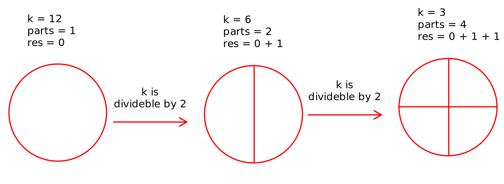
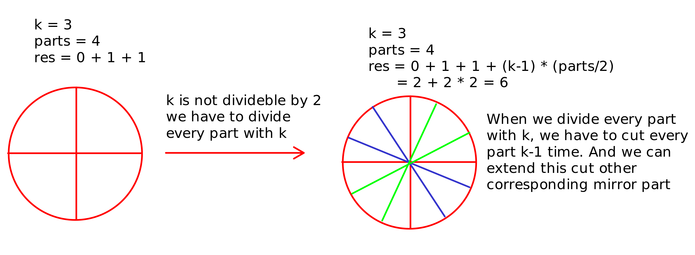

# Question

A valid cut in a circle can be:

A cut that is represented by a straight line that touches two points on the edge of the circle and passes through its center, or
A cut that is represented by a straight line that touches one point on the edge of the circle and its center.

Some valid and invalid cuts are shown in the figures below.

Given the integer n, return the minimum number of cuts needed to divide a circle into n equal slices.

 

Example 1:

    Input: n = 4
    Output: 2
    Explanation: 
    The above figure shows how cutting the circle twice through the middle divides it into 4 equal slices.

Example 2:

    Input: n = 3
    Output: 3
    Explanation:
    At least 3 cuts are needed to divide the circle into 3 equal slices. 
    It can be shown that less than 3 cuts cannot result in 3 slices of equal size and shape.
    Also note that the first cut will not divide the circle into distinct parts.

 

Constraints:

    1 <= n <= 100

# Solution

```java
class Solution {
    public int numberOfCuts(int n) {
        if(n == 1) return 0;

        int res = 0;
        int k = n;
        int parts = 1;
        while(k % 2 == 0){
            if(parts < 2){
                res += 1;
                parts += 1;
            }
            else{
                res += (parts / 2);
                parts *= 2;
            }
            k /= 2;
        }

        if(k == n) return k;

        res += (parts/2) * (k-1); 
        
        return res;
    }
}
```

In code k means number of divisions for every part because of that we initialize k with n. And if k divideble by 2 we divide k variable and store number of parts in parts variable. If parts less than 2 we add 1 to result because we need to cut circle at least 1 time. If parts more than 2 we add parts/2 to result because we need to cut circle at least parts/2 times. After that we divide k by 2. If k is not equal to n it means that we have some parts that we need to cut more than 1 time. So we add (parts/2) * (k-1) to result. And return result.



