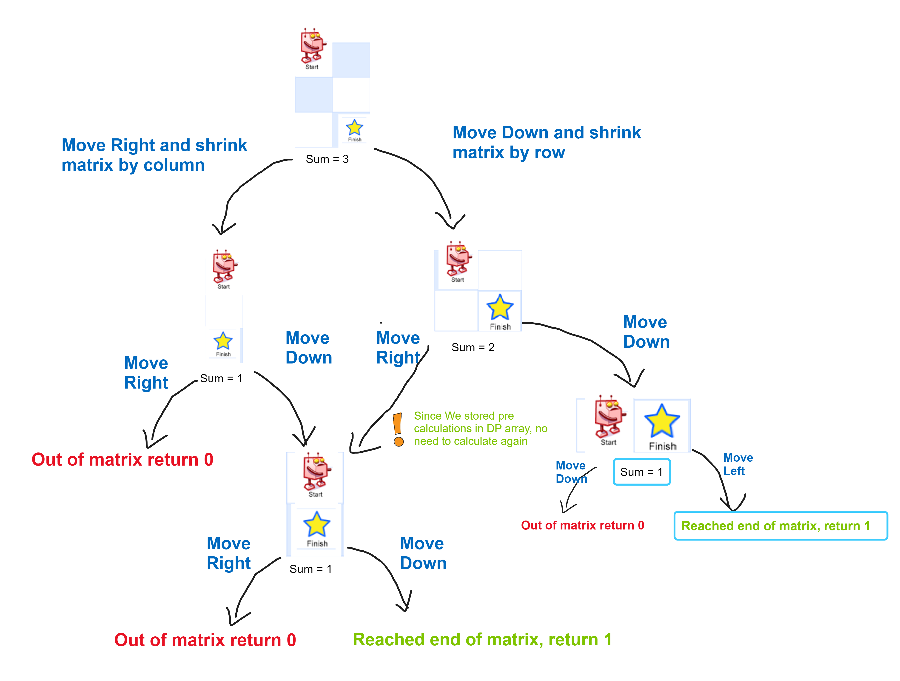

# Question

[Link](https://leetcode.com/problems/unique-paths/description/)

There is a robot on an m x n grid. The robot is initially located at the top-left corner (i.e., grid[0][0]). The robot tries to move to the bottom-right corner (i.e., grid[m - 1][n - 1]). The robot can only move either down or right at any point in time.

Given the two integers m and n, return the number of possible unique paths that the robot can take to reach the bottom-right corner.

The test cases are generated so that the answer will be less than or equal to 2 * 10^9.


Example 1:

    Input: m = 3, n = 7
    Output: 28

Example 2:

    Input: m = 3, n = 2
    Output: 3
    Explanation: From the top-left corner, there are a total of 3 ways to reach the bottom-right corner:
    1. Right -> Down -> Down
    2. Down -> Down -> Right
    3. Down -> Right -> Down

 

Constraints:

    1 <= m, n <= 100

# Solution

Runtime : 1ms

```java
class Solution {
    Map<Integer, Integer> map;

    public int getKey(int m, int n){
        return (m * 1000) + n;
    }

    public Solution() { map = new HashMap<Integer, Integer>(); }

    public int recursivePaths(int m, int n){
        if(m == 0 || n == 0) return 0;
        if(m == 1 && n == 1) return 1;

        int key = getKey(m,n);
        if(map.containsKey( key )) return map.get(key); 

        map.put(key, recursivePaths(m-1, n) + recursivePaths(m, n-1));

        return map.get(key);
    }

    public int uniquePaths(int m, int n) {
        return recursivePaths(m,n);
    }
}
```

