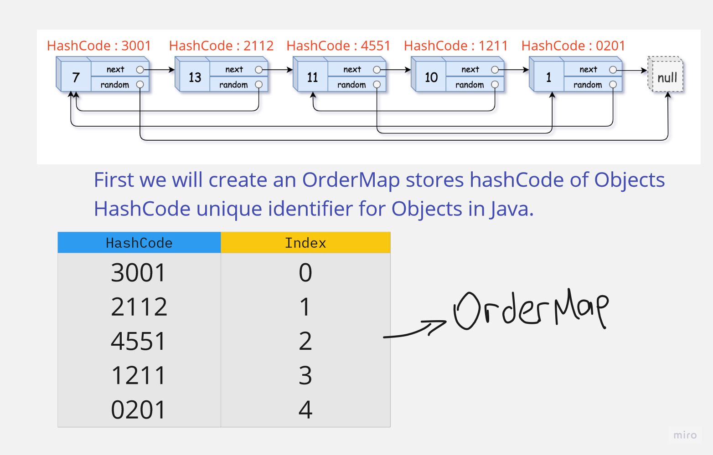
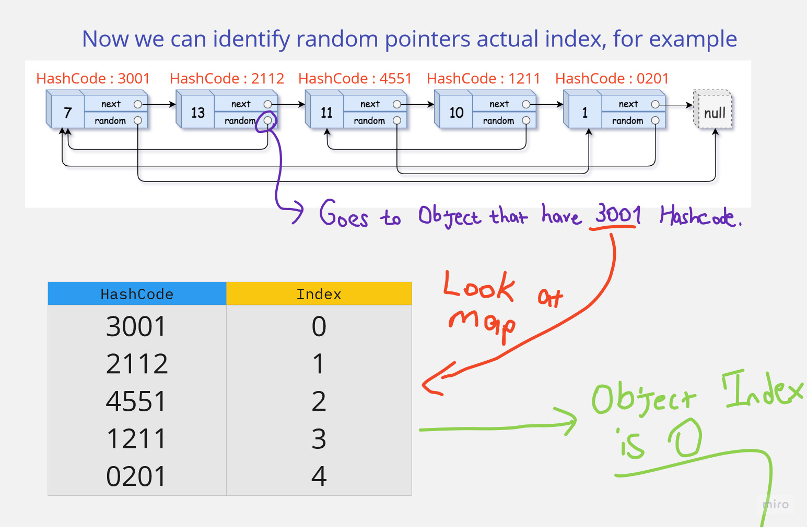

# Question

[Link](https://leetcode.com/problems/copy-list-with-random-pointer)

A linked list of length n is given such that each node contains an additional random pointer, which could point to any node in the list, or null.

Construct a deep copy of the list. The deep copy should consist of exactly n brand new nodes, where each new node has its value set to the value of its corresponding original node. Both the next and random pointer of the new nodes should point to new nodes in the copied list such that the pointers in the original list and copied list represent the same list state. None of the pointers in the new list should point to nodes in the original list.

For example, if there are two nodes X and Y in the original list, where X.random --> Y, then for the corresponding two nodes x and y in the copied list, x.random --> y.

Return the head of the copied linked list.

The linked list is represented in the input/output as a list of n nodes. Each node is represented as a pair of [val, random_index] where:

val: an integer representing Node.val
random_index: the index of the node (range from 0 to n-1) that the random pointer points to, or null if it does not point to any node.

Your code will only be given the head of the original linked list.

 

Example 1:


    Input: head = [[7,null],[13,0],[11,4],[10,2],[1,0]]
    Output: [[7,null],[13,0],[11,4],[10,2],[1,0]]

Example 2:


    Input: head = [[1,1],[2,1]]
    Output: [[1,1],[2,1]]

Example 3:


    Input: head = [[3,null],[3,0],[3,null]]
    Output: [[3,null],[3,0],[3,null]]

Constraints:

    0 <= n <= 1000
    -104 <= Node.val <= 104
    Node.random is null or is pointing to some node in the linked list.

# Solution

Runtime : 1ms

```java
/*
// Definition for a Node.
class Node {
    int val;
    Node next;
    Node random;

    public Node(int val) {
        this.val = val;
        this.next = null;
        this.random = null;
    }
}
*/

class Solution {
    Map<Integer, Integer> orderMap;
    List<Integer> orderList;
    ArrayList<Node> refs;

    public void traverseList(Node head, int index){
        if(head == null) return;
        orderMap.put(head.hashCode(), index);
        traverseList(head.next, index+1);
    }

    public void getOrder(Node head){
        if(head == null) return;
        if(head.random == null) orderList.add( -1 );
        else{
            int hash_code = head.random.hashCode();
            orderList.add( orderMap.get(hash_code) );
        }
        getOrder(head.next);
    }

    public Node generateEmptyList(int length){
        Node newNode = new Node(length);
        Node temp = newNode;
        while(length != 1){
            Node nextNode = new Node(length - 1);
            temp.next = nextNode;
            temp = nextNode;
            length -= 1;  
        }
        
        return newNode;
    }

    public ArrayList<Node> getNodeRefs(Node node){
        Node temp = node;
        ArrayList<Node> refs = new ArrayList<>();
        while(temp != null){
            refs.add(temp);
            //System.out.println(refs.get(refs.size() - 1).val);
            temp = temp.next;
        }
        return refs;
    }

    public void deepCopyList(Node head, Node newList, int index){
        if(head == null) return;

        int random_order = orderList.get(index);
        if(random_order == -1) newList.random = null;
        else newList.random = refs.get(random_order);
        newList.val = head.val; 

        deepCopyList(head.next, newList.next, index+1);
    }

    public Node copyRandomList(Node head) {
        if(head == null) return null;
        
        orderMap = new HashMap<Integer, Integer>();
        orderList = new ArrayList<Integer>();
        refs = new ArrayList<Node>();

        traverseList(head, 0);
        getOrder(head);

        //for(int i : orderList) System.out.println(i);

        Node newList = generateEmptyList(orderList.size());
        refs = getNodeRefs(newList);
        deepCopyList(head, newList, 0);

        return newList;
    }
}
```

In this solution, I first traverse the list and store the order of each node in a map. Then I traverse the list again and store the order of the random pointer of each node in a list. Then I generate a new list with the same length as the original list. Then I traverse the list again and set the random pointer of each node in the new list according to the order list.




