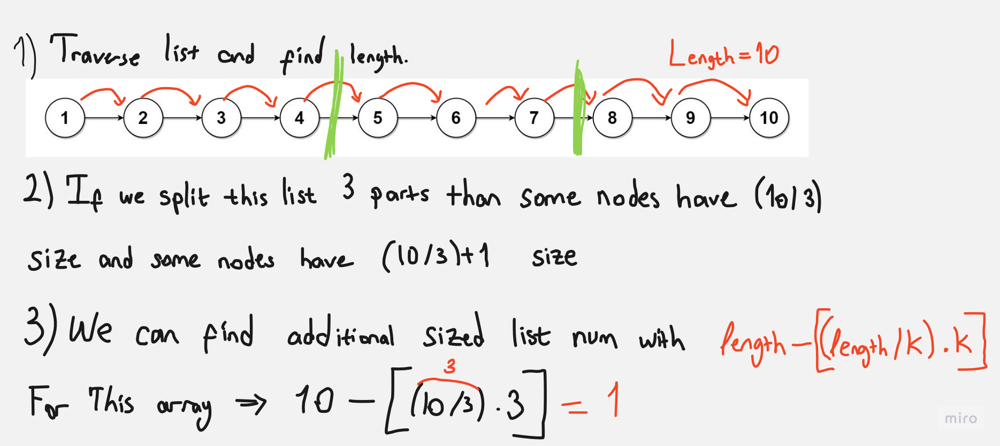
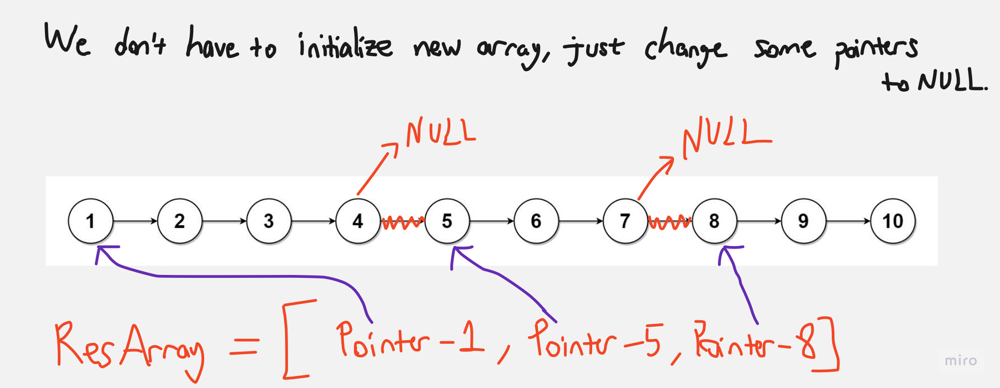

# Question

[Link](https://leetcode.com/problems/split-linked-list-in-parts/description/)

Given the head of a singly linked list and an integer k, split the linked list into k consecutive linked list parts.

The length of each part should be as equal as possible: no two parts should have a size differing by more than one. This may lead to some parts being null.

The parts should be in the order of occurrence in the input list, and parts occurring earlier should always have a size greater than or equal to parts occurring later.

Return an array of the k parts.

 

Example 1:


    Input: head = [1,2,3], k = 5
    Output: [[1],[2],[3],[],[]]
    Explanation:
    The first element output[0] has output[0].val = 1, output[0].next = null.
    The last element output[4] is null, but its string representation as a ListNode is [].

Example 2:


    Input: head = [1,2,3,4,5,6,7,8,9,10], k = 3
    Output: [[1,2,3,4],[5,6,7],[8,9,10]]
    Explanation:
    The input has been split into consecutive parts with size difference at most 1, and earlier parts are a larger size than the later parts.


Constraints:

    The number of nodes in the list is in the range [0, 1000].
    0 <= Node.val <= 1000
    1 <= k <= 50

# Solution

Runtime : 0 ms

```java
/**
 * Definition for singly-linked list.
 * public class ListNode {
 *     int val;
 *     ListNode next;
 *     ListNode() {}
 *     ListNode(int val) { this.val = val; }
 *     ListNode(int val, ListNode next) { this.val = val; this.next = next; }
 * }
 */
class Solution {
    public int getLength(ListNode head){
        if(head == null) return 0;
        return getLength(head.next) + 1;
    }

    public ListNode[] splitListToParts(ListNode head, int k) {
        int length = getLength(head);
        int size = length / k;
        int additions = length - (k*size);

        if(size == 0) additions = length;
        //System.out.println(length + "  " + size + "  " + additions);

        ListNode temp = head;
        ListNode[] res = new ListNode[k];
        for(int i=0; i<k; i++){
            int index = (size*i);
            int lastIndex = (size*(i+1)) - 1;
            if(additions > 0){
                additions -= 1;
                lastIndex += 1;
            }

            ListNode added = temp;
            res[i] = added;
            if(temp == null) continue;

            //System.out.println(temp.val);
            for(int j=index; j<lastIndex; j++) temp = temp.next;

            ListNode temp2 = temp.next;
            temp.next = null;
            temp = temp2;
        }  

        return res; 
    }
}
```

Firstly we will calculate length of list by traversing it recursively. Then we will calculate size of each part and number of parts that will have size + 1. Then we will traverse the list again and add the nodes to the result array.

When we will divide the list into parts, we will not initiate a new list. We will just add the head of the list to the result array. Then we will traverse the list till the end of the part and then we will set the next of the last node of the part to null. Then we will move to the next part and repeat the process.



