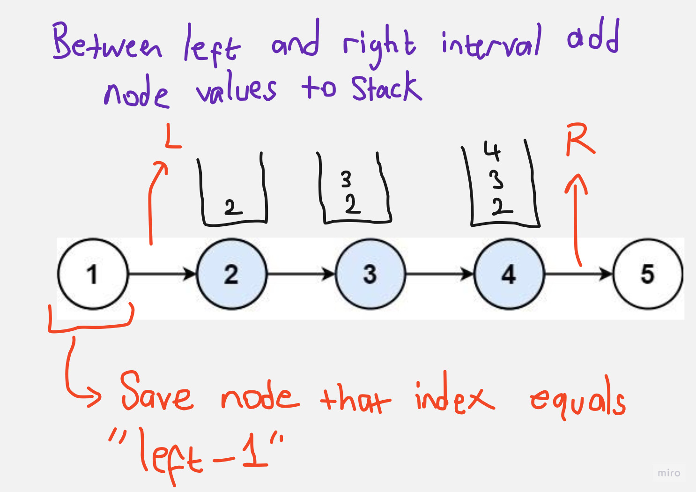

# Question

[Link](https://leetcode.com/problems/reverse-linked-list-ii/description/)

Given the head of a singly linked list and two integers left and right where left <= right, reverse the nodes of the list from position left to position right, and return the reversed list.

Example 1:


    Input: head = [1,2,3,4,5], left = 2, right = 4
    Output: [1,4,3,2,5]

Example 2:

    Input: head = [5], left = 1, right = 1
    Output: [5]

Constraints:

    The number of nodes in the list is n.
    1 <= n <= 500
    -500 <= Node.val <= 500
    1 <= left <= right <= n

 
Follow up: Could you do it in one pass?

# Solution

Runtime : 1ms

```java
/**
 * Definition for singly-linked list.
 * public class ListNode {
 *     int val;
 *     ListNode next;
 *     ListNode() {}
 *     ListNode(int val) { this.val = val; }
 *     ListNode(int val, ListNode next) { this.val = val; this.next = next; }
 * }
 */
class Solution {
    Stack<Integer> stack;

    public ListNode reverseBetweenRecursive(ListNode head, ListNode start, int index, int left, int right){
        if(index + 1 == left) start = head;

        if(index >= left && index <= right){
            stack.push(head.val);
        }
        else if(index > right && !stack.empty()){
            int i = stack.pop();
            ListNode headOfReversed = new ListNode(i);
            ListNode temp = headOfReversed;
            while(!stack.empty()){ 
                i = stack.pop();
                temp.next = new ListNode(i);
                temp = temp.next;
            }
            if(temp != null) temp.next = head;
            if(start != null) start.next = headOfReversed;
            else return headOfReversed;
            return null;
        }

        return reverseBetweenRecursive(head.next, start, index+1, left, right);
        
    }

    public ListNode reverseBetween(ListNode head, int left, int right) {
        stack = new Stack<>();
        
        if(left != right) {
            ListNode newHead = reverseBetweenRecursive(head, null, 1, left, right);
            if(newHead != null) head = newHead;
        }

        return head;
    }
}
```




